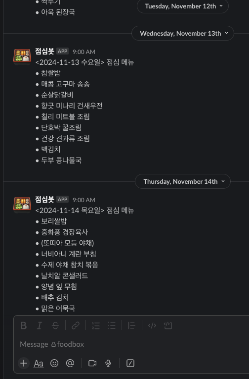

# 🍽️ Foodbox

## Overview

### Preview




### Intro

Foodbox is a tool designed to make it easy for employees to check the daily lunch menu. The lunch vendor posts the menu
on their website as an image, and this project automates the process of sharing that information with everyone. The key
features include:

- **Crawling**: Fetching the daily menu image from the food vendor's website.
- **OCR Processing**: Using Clova OCR to extract text from the menu image.
- **Data Structuring**: Analyzing and organizing the menu for each date into a structured format.
- **Notification**: Sending the lunch menu via a Slack bot at the beginning of each workday, so everyone knows what's
  for lunch.

The goal is to ensure everyone has quick and easy access to the lunch menu, without needing to search for it manually.

## Deployment

### Prerequisites

- Docker
- Docker Compose
- Java 21+

### Configuration

after git clone, make `.env` file in the same directory as `docker-compose.yml` and fill in the following values:

```properties
SLACK_TOKEN=your_slack_token
SLACK_CHANNEL=#your_slack_channel
CLOVA_URL=your_clova_url_here(general)
CLOVA_SECRET_KEY=your_clova_secret_here
```

### Run

```bash
git clone https://github.com/ArgonetDevStudio/foodbox.git
cd foodbox
./gradlew clean build
docker compose up -d
```

