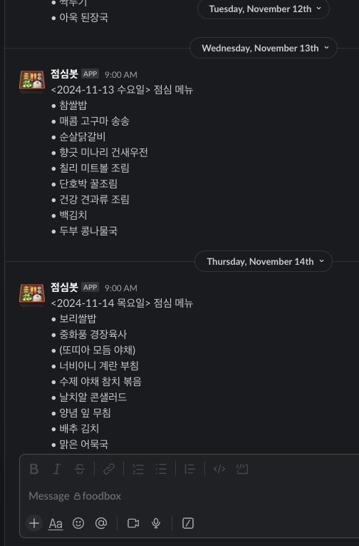

# Foodbox

Foodbox downloads Eisodosirak menu images, parses them with Naver Clova OCR, stores the results in a file-based database, and exposes the lunch menu through a web calendar and Slack notifications.



## Tech Stack

- Backend: Spring Boot 3.5.14, Java 25, Gradle
- Frontend: Svelte 5, Vite
- OCR: Naver Clova OCR
- Crawling: JSoup, image download
- Storage: file-based JSON database
- Deployment: Docker Compose, Nginx

## Quick Start

### 1. Prerequisites

- Java 25
- Node.js 20+
- npm
- Docker / Docker Compose, if running the production-like stack

### 2. Environment Variables

Create a `.env` file from `.env.example` before running the app locally.

```bash
cp .env.example .env
```

Required values:

```properties
SLACK_TOKEN=your_slack_bot_token_here
SLACK_CHANNEL=#your_slack_channel_here
CRAWL_URL=https://eisodosirak.itpage.kr/bbs/board.php?bo_table=basic4
CLOVA_URL=your_clova_api_url_here
CLOVA_SECRET_KEY=your_clova_secret_key_here
```

`DB_FILE_DIR` is optional. The development profile uses `/tmp/foodbox/db` by default.

Docker Compose reads `.env` automatically. When running locally with `./gradlew bootRun`, export the environment variables in the same terminal first.

```bash
set -a
source .env
set +a
```

### 3. Run Backend

For development, run the backend with the `dev` profile because the frontend Vite proxy forwards API requests to `localhost:8080`.

```bash
set -a
source .env
set +a
SPRING_PROFILES_ACTIVE=dev ./gradlew bootRun
```

Check the backend:

```bash
curl http://localhost:8080/api/menu
```

### 4. Run Frontend

Run the frontend in a separate terminal.

```bash
cd front
npm install
npm run dev
```

Open `http://localhost:5173` in your browser. Frontend `/api/*` requests are proxied to `http://localhost:8080` by `front/vite.config.js`.

## Common Commands

### Backend

```bash
./gradlew clean build
./gradlew test
SPRING_PROFILES_ACTIVE=dev ./gradlew bootRun
```

### Frontend

```bash
cd front
npm install
npm run dev
npm run build
npm run preview
```

### Docker Compose

Build the backend JAR before starting Docker.

```bash
./gradlew clean build
docker compose up -d
docker compose logs -f foodbox-backend
```

Compose services:

- `foodbox-backend`: Spring Boot app, container port 80
- `foodbox-frontend`: Nginx serving Svelte build, host ports 80/443
- `./db`: mounted to `/db` in the backend container
- `/api/*`: proxied by Nginx to the backend service

`front/nginx.conf` currently assumes the `foodbox.o-r.kr` domain and Let's Encrypt certificate paths. To test HTTPS locally with Docker, adjust the Nginx config or certificate mounts for your environment.

## API Endpoints

| Method | Endpoint | Description |
| --- | --- | --- |
| `GET` | `/api/menu/today` | Get today's menu |
| `GET` | `/api/menu` | Get all stored menus |
| `GET` | `/api/crawl` | Manually crawl and OCR-parse the menu image |
| `POST` | `/api/upload` | Upload a menu image and OCR-parse it |
| `GET` | `/api/slack/notify` | Manually send today's Slack notification |

`/api/crawl` and `/api/slack/notify` change server-side state, but the current implementation uses `GET`.

## Project Structure

```text
.
├── src/main/java/shanepark/foodbox
│   ├── api
│   │   ├── controller      # REST API
│   │   ├── domain          # Menu, ApiResponse, DTOs
│   │   ├── repository      # file-based menu storage
│   │   └── service         # menu crawl, parse, lookup flow
│   ├── crawl               # vendor page/image crawling
│   ├── image
│   │   ├── domain          # parsed menu and OCR regions
│   │   └── ocr             # Clova OCR client/parser and margin calculator
│   └── slack               # Slack schedule, message formatting, sender
├── src/main/resources
│   ├── application.yml
│   └── application-dev.yml
└── front
    ├── src                 # Svelte app
    ├── vite.config.js      # dev API proxy to localhost:8080
    └── nginx.conf          # production frontend/API proxy
```

## How It Works

1. `MenuService` starts up and checks whether stored menu data is up to date.
2. If data is missing or stale, `MenuCrawler` downloads the vendor menu image.
3. The image hash is compared with the previous crawl to avoid duplicate OCR work.
4. `ImageParserClovaEiso` sends the image to Naver Clova OCR and parses date/menu regions.
5. Parsed menus are saved by `MenuRepository` in the configured DB directory.
6. The Svelte app reads `/api/menu` and renders a monthly calendar.
7. `SlackNotifyService` sends the daily 9 AM notification, with special Wednesday handling.

## Business Rules

- A menu is valid only when it has at least 3 menu items.
- Invalid menus are skipped for Slack notifications and are treated like holiday/no-menu cases.
- Weekends do not send lunch notifications.
- Wednesdays are special:
  - first three Wednesdays of a month: Dennis Deli salad day
  - last Wednesday of a month: eating-out day
- OCR dates that contain only month and day are resolved to the closest date within the current, previous, or next year window.

## Tests

Run all tests:

```bash
./gradlew test
```

Focused test examples:

```bash
./gradlew test --tests MenuRepositoryTest
./gradlew test --tests ImageMarginCalculatorEisoTest
./gradlew test --tests ImageParserClovaEisoTest
./gradlew test --tests SlackNotifyServiceTest
./gradlew test --tests SlackMessageSenderTest
```

OCR parser tests use sample image/OCR resources under `src/test/resources`.

## Development Notes

### Updating Image Parsing

1. Add or update sample menu images and OCR JSON under `src/test/resources`.
2. Adjust region detection in `ImageMarginCalculatorEiso`.
3. Adjust parsing in `ImageParserClovaEiso` or `ParsedMenuEiso`.
4. Run `./gradlew test --tests ImageParserClovaEisoTest`.
5. Run `./gradlew clean build`.

### Updating Slack Logic

1. Update `SlackNotifyService` or `NotifyDate`.
2. Add or update cases in `SlackNotifyServiceTest`.
3. Run `./gradlew test --tests SlackNotifyServiceTest`.

### Adding a New Vendor

1. Create a vendor-specific `ImageParserClova{Vendor}`.
2. Create a vendor-specific `ImageMarginCalculator{Vendor}`.
3. Add image/OCR fixtures under `src/test/resources`.
4. Update `CRAWL_URL`.
5. Update `MenuCrawler.getMenuImage()` if the vendor page structure differs.
6. Add parser tests before deploying.

## Troubleshooting

- Frontend shows no data: confirm the backend is running on `localhost:8080` and `curl http://localhost:8080/api/menu` returns JSON.
- Frontend API calls fail in dev: check `front/vite.config.js`; the proxy target should match the backend port.
- Backend starts on port 80: run with `SPRING_PROFILES_ACTIVE=dev` for port 8080.
- OCR parsing fails: verify `CLOVA_URL` and `CLOVA_SECRET_KEY`, then inspect parser tests and OCR fixtures.
- Slack notification fails: verify Slack webhook token/channel config and run `GET /api/slack/notify` manually.
- Docker frontend fails on HTTPS locally: `front/nginx.conf` expects production certificate paths for `foodbox.o-r.kr`.
